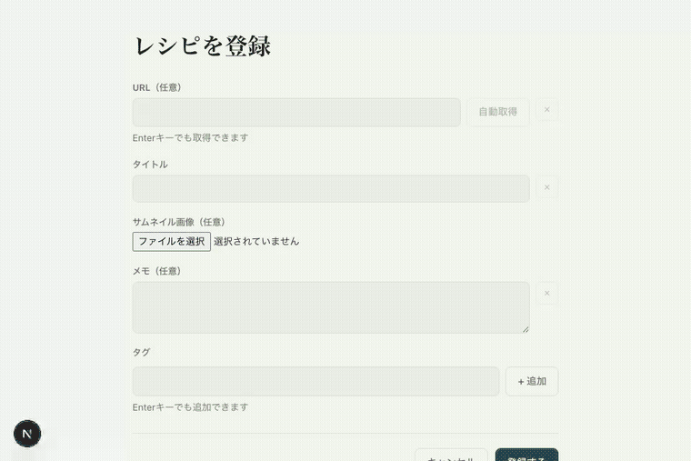
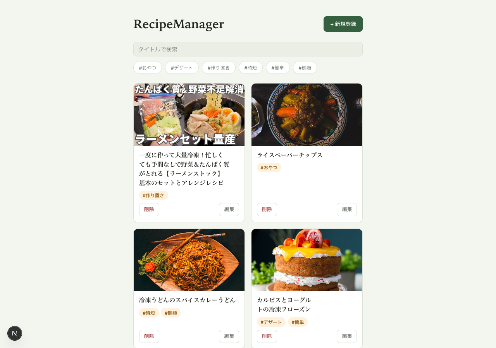
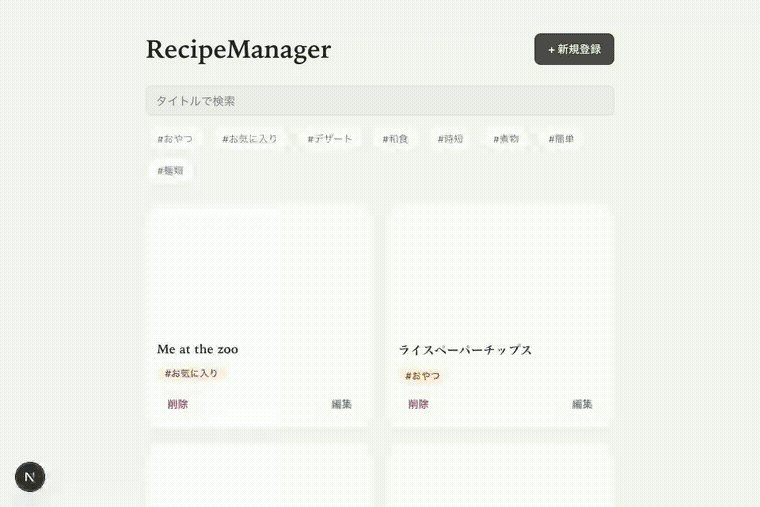
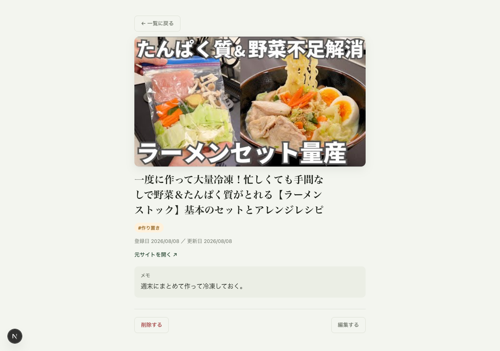
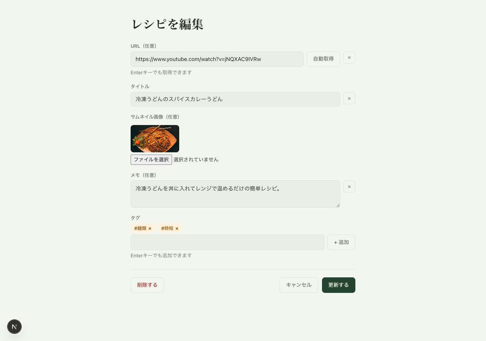

# RecipeManager

YouTubeやレシピサイトに掲載されているレシピを、自分用にブックマークして管理できるアプリ。気に入ったレシピへのリンクを、サムネイル画像・メモ・タグと一緒に保存しておける、個人用のレシピブックマークアプリです（レシピの材料・作り方自体を作成・編集する機能ではありません）。

スクールの課題として開発しており、以前の課題（Java + Spring Boot / React + TypeScript）とは異なる技術スタックを使い、AWSの無料枠に収まる構成にすることが条件です。

## 公開URL

AWSへのデプロイ・動作確認は完了済みだが、コストを抑えるため現在はインフラを`terraform destroy`で削除しており、公開URLは動いていない（インフラの再構築手順は [infra/terraform/README.md](infra/terraform/README.md) を参照）。

## 使い方

### レシピの登録



URLを入力して「自動取得」を押す（またはEnter）と、タイトル・サムネイル画像を自動で取得する。自動取得に失敗した場合は、タイトルを手動入力し、画像ファイルをアップロードして代替できる。あわせてメモと複数のタグを付けて登録する。

### レシピ一覧



登録済みレシピをカードで一覧表示する。

### 検索・タグ絞り込み



タイトルのキーワード検索と、タグのクリックによる絞り込みができる（両方を組み合わせることもできる）。

### レシピ詳細



メモ・タグとともにレシピを表示し、元のYouTube動画／レシピサイトへのリンクから遷移できる。

### 編集・削除



登録済みレシピのタイトル・サムネイル・メモ・タグを編集できる。編集画面・詳細画面それぞれから削除もできる。

## 技術スタック

| レイヤー | 採用技術 |
|----------|----------|
| バックエンド | Kotlin + Spring Boot |
| フロントエンド | Next.js + TypeScript |
| データベース | MySQL |
| インフラ | AWS + Docker + Terraform |

## ドキュメント

- [要件定義書](docs/requirements.md) — 何を作るか・なぜ作るか
- [基本設計書](docs/basic-design.md) — どう作るか（技術スタック、構成図、画面設計、データ設計、API設計など）
- [用語集](docs/glossary.md) — インフラ・クラウド関連の用語まとめ
- [フロントエンド読み方メモ](docs/frontend-reading-notes.md) — Reactコードの読み方パターン（自分用）

## セットアップ

### 前提

- Java 21
- Node.js 22
- Docker Desktop

### 手順

```sh
# 1. 環境変数ファイルを用意する
cp .env.example .env

# 2. DB（MySQL）を起動する
docker compose up -d db

# 3. バックエンド（Spring Boot）を起動する
cd backend
./gradlew bootRun
# → http://localhost:8080

# 4. フロントエンド（Next.js）を起動する（別ターミナル）
cd frontend
npm install
npm run dev
# → http://localhost:3000
```

### テスト・Lint

```sh
# バックエンド
cd backend
./gradlew ktlintCheck
./gradlew test

# フロントエンド
cd frontend
npm run lint
npm run test
```

## インフラ構築・デプロイ

AWSインフラ（VPC・EC2・RDS・CloudFrontなど）はTerraformで構築している。構築手順は [infra/terraform/README.md](infra/terraform/README.md) を参照。

EC2上へのアプリのデプロイ手順（Terraformで構築済みのEC2が前提）:

```sh
# 1. EC2にSSH接続する
ssh -i ~/.ssh/recipemanager_ec2 ec2-user@<EC2のパブリックIP>

# 2. 初回のみ: リポジトリをクローンする（2回目以降は git pull）
git clone https://github.com/marinnk/RecipeManager.git app
cd app

# 3. 初回のみ: 本番用の .env を作成する（RDSの接続情報。Gitには含めない）
cat > .env <<EOF
DB_HOST=<RDSのエンドポイント（terraform output rds_endpointで確認）>
DB_NAME=<RDSのDB名>
DB_USERNAME=<RDSのユーザー名>
DB_PASSWORD=<RDSのパスワード>
EOF

# 4. ビルド・起動する
docker compose -f docker-compose.prod.yml up -d --build
```
