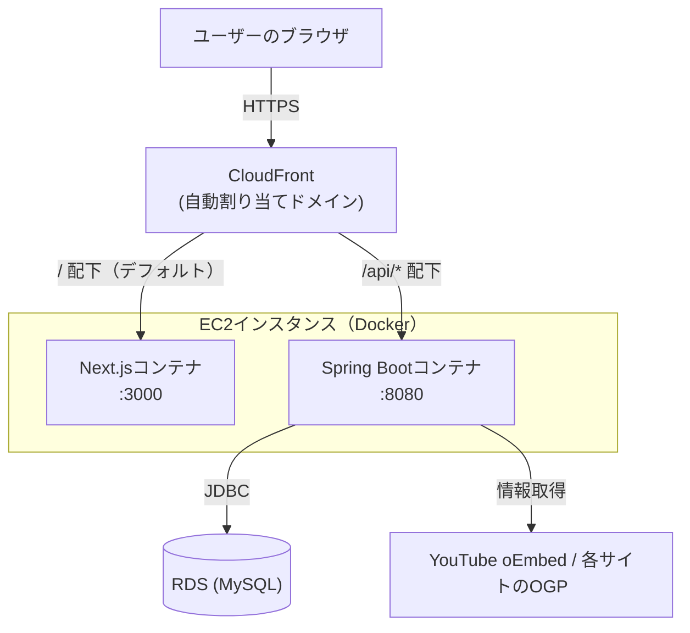
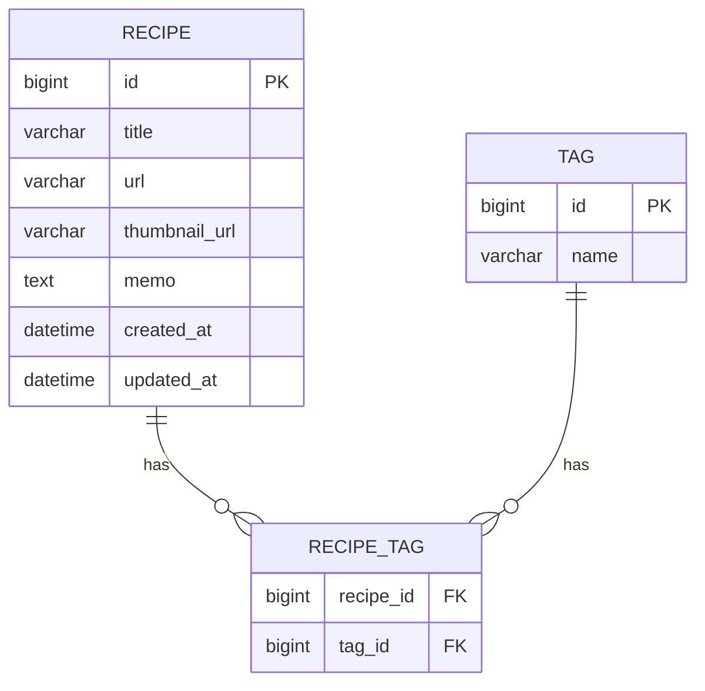

# RecipeManager 基本設計書

## 0. 本書について

本書は [docs/requirements.md](./requirements.md)（要件定義書）で決めた「何を作るか」を受けて、「どう作るか」を技術的な観点でまとめたものです。主にエンジニア（開発者本人）向けの資料であり、AWSやフレームワーク固有の用語を要件定義書ほど噛み砕かずに記載します。

## 1. 技術スタックと選定理由

スクールの方針で「以前の課題（Java + Spring Boot / React + TypeScript）と異なる技術スタックを使うこと」が条件となっているため、以下を採用する。

| レイヤー | 採用技術 | 選定理由 |
|----------|----------|----------|
| バックエンド | Kotlin + Spring Boot | Spring Bootが動作する言語はJava/Kotlin/Groovyに限られる中、「Java以外」の条件を満たしつつ学習リソースが豊富なKotlinを選択 |
| フロントエンド | Next.js + TypeScript | Reactをベースとしつつ、以前と異なるフレームワーク（Next.js）を採用することで差別化。TypeScript自体は継続利用 |
| データベース | MySQL | 「Postgres以外」の条件を満たすため |
| インフラ | AWS + Docker + Terraform | コンテナ化とIaC（Infrastructure as Code）による構成管理。無料枠内での運用を前提とする |

## 2. システム構成図

独自ドメインは取得せず、CloudFrontが自動で割り当てるドメイン（`https://xxxxxxxxxx.cloudfront.net`）をそのまま使う。この場合、CloudFront標準の証明書でHTTPS化されるため、ACM証明書を別途発行する必要はない。

フロントエンド（Next.js）とバックエンド（Spring Boot）は同一のEC2インスタンス上でDockerコンテナとして動かし、CloudFrontがパスに応じてどちらのコンテナに転送するかを振り分ける。ALB（ロードバランサー）は使わず、CloudFrontから直接EC2（カスタムオリジン）に転送することで構成をシンプルにし、コストも抑える。



- ブラウザ上のNext.jsが `/api/...` へリクエストすることで、Spring Bootのレシピ登録・取得・更新・削除APIを呼び出す（詳細は次章のAPI設計を参照）
- EC2とRDSは同一VPC内の同じ（パブリック）サブネットに置き、RDSのセキュリティグループは「EC2からの3306番ポートのみ許可」とすることで、NAT Gatewayを使わずに安全性を確保する

## 3. 画面設計・画面遷移

| 画面 | 内容 |
|------|------|
| レシピ一覧画面（トップ） | 登録済みレシピのカード一覧、検索・タグ絞り込みUI、新規登録への導線 |
| レシピ登録画面 | URL入力欄、自動取得プレビュー（タイトル・サムネイル、手動修正可）、メモ・タグ入力欄 |
| レシピ詳細画面 | レシピの詳細情報、元サイト／動画へのリンク、編集・削除ボタン |
| レシピ編集画面 | 登録画面と同様のフォームに既存データを表示し、更新できる |

画面遷移: 一覧画面 → （新規登録 or カードクリックで詳細画面）→ 詳細画面から編集画面へ

## 4. データ設計

### Recipe（レシピ）
| 項目 | 型 | 説明 |
|------|-----|------|
| id | bigint | 主キー |
| title | varchar | レシピタイトル（自動取得 or 手動入力） |
| url | varchar | 元レシピのURL |
| thumbnail_url | varchar | サムネイル画像のURL（画像自体は保存せず、URL文字列のみ保持） |
| memo | text | ユーザーの自由メモ |
| created_at / updated_at | datetime | 登録日・更新日 |

### Tag（タグ）
| 項目 | 型 | 説明 |
|------|-----|------|
| id | bigint | 主キー |
| name | varchar | タグ名（自由入力） |

### RecipeTag（中間テーブル）
- recipe_id と tag_id の多対多を表す中間テーブル

### ER図



## 5. 外部連携方式

| 連携先 | 用途 | 方式 |
|--------|------|------|
| YouTube | 動画のタイトル・サムネイル取得 | YouTube oEmbed API |
| クックパッド等レシピサイト | ページのタイトル・画像取得 | OGP（`og:title`, `og:image`等）メタタグをサーバー側で取得・パース |

いずれも取得に失敗した場合は、ユーザーが手動でタイトル・画像URLを入力できるようフォールバックする。

## 6. セキュリティ実装方針

- **通信の暗号化（HTTPS化）**: CloudFrontの自動割り当てドメインを使うため、CloudFront標準の証明書でHTTPS化される（ACM証明書の個別発行は不要）
- **シークレット情報の管理**: DBパスワードなどの機密情報は環境変数（`.env`ファイル）で管理し、Gitリポジトリには含めない。AWS Secrets Managerは月額費用が発生し無料枠の方針に合わないため使用しない
- **SQLインジェクション対策**: Spring Data JPAのパラメータバインディングを利用し、SQLを文字列結合で組み立てない

## 7. AWS構成方針（コスト面）

- EC2/RDSはmicroクラスのインスタンスを使用
- NAT Gatewayやマルチ AZ構成、ALB（ロードバランサー）など、恒常的に費用がかかる要素は避ける（「2. システム構成図」の通り、CloudFrontから直接EC2に転送する構成とする）
- AWS Budgetsで予算アラートを設定し、無料枠超過に早期に気づけるようにする
- 具体的なVPC・サブネット構成は、次の実装フェーズで別途決定する

## 8. API設計

フロントエンド（Next.js）とバックエンド（Spring Boot）は `/api` 配下のREST APIでやり取りする。レスポンスはJSON形式とする。

### エンドポイント一覧

| メソッド | パス | 内容 | 対応する機能要件 |
|----------|------|------|-------------------|
| GET | `/api/recipes` | レシピ一覧を取得する（`keyword`・`tag`クエリパラメータで絞り込み可） | レシピ一覧表示、検索・絞り込み |
| GET | `/api/recipes/{id}` | レシピ1件の詳細を取得する | レシピ詳細表示 |
| POST | `/api/recipes` | レシピを新規登録する | レシピ登録 |
| PUT | `/api/recipes/{id}` | レシピを更新する | レシピ編集 |
| DELETE | `/api/recipes/{id}` | レシピを削除する | レシピ削除 |
| GET | `/api/tags` | 登録済みの全タグ一覧を取得する（絞り込みUIの候補表示用） | 検索・絞り込み |
| POST | `/api/metadata/fetch` | URLからタイトル・サムネイルを自動取得する | レシピ登録（自動取得） |

### 主なリクエスト・レスポンス例

**GET /api/recipes?keyword=肉&tag=和食**
```json
[
  {
    "id": 1,
    "title": "肉じゃが",
    "url": "https://www.youtube.com/watch?v=xxxx",
    "thumbnailUrl": "https://i.ytimg.com/vi/xxxx/hqdefault.jpg",
    "memo": "醤油を控えめにすると美味しい",
    "tags": ["和食", "煮物"],
    "createdAt": "2026-08-01T10:00:00Z",
    "updatedAt": "2026-08-01T10:00:00Z"
  }
]
```

**POST /api/recipes（リクエストボディ）**
```json
{
  "title": "肉じゃが",
  "url": "https://www.youtube.com/watch?v=xxxx",
  "thumbnailUrl": "https://i.ytimg.com/vi/xxxx/hqdefault.jpg",
  "memo": "醤油を控えめにすると美味しい",
  "tags": ["和食", "煮物"]
}
```
レスポンスは登録後のレシピ（`id`・`createdAt`・`updatedAt`を含む）を返す。

**POST /api/metadata/fetch（リクエストボディ）**
```json
{ "url": "https://www.youtube.com/watch?v=xxxx" }
```
成功時レスポンス:
```json
{ "title": "肉じゃがの作り方", "thumbnailUrl": "https://i.ytimg.com/vi/xxxx/hqdefault.jpg" }
```

### エラーレスポンス

| ステータス | 状況 | レスポンス例 |
|------------|------|--------------|
| 400 | 入力値が不正（必須項目の未入力など） | `{ "error": "VALIDATION_ERROR", "message": "titleは必須です" }` |
| 404 | 指定したidのレシピが存在しない | `{ "error": "NOT_FOUND", "message": "指定されたレシピが見つかりません" }` |
| 422 | URLからのタイトル・サムネイル自動取得に失敗した | `{ "error": "METADATA_FETCH_FAILED", "message": "情報を取得できませんでした。手動で入力してください" }` |
| 500 | サーバー内部エラー | `{ "error": "INTERNAL_ERROR", "message": "サーバーエラーが発生しました" }` |

## 9. 非機能要件への対応方針

- **想定利用者・同時アクセス数**: 開発者本人および評価者による利用を想定し、大量の同時アクセスは想定しない
- **可用性**: EC2・RDSともに単一AZ・単体構成のため、インスタンス障害時にはサービスが停止する。学校課題の規模を踏まえ、マルチAZ構成などの高可用性対応は行わない（詳細は「7. AWS構成方針」を参照）
- **バックアップ**: RDSの自動バックアップ機能（デフォルトの保持期間）を有効化する。障害・誤操作時はここから復元する

## 10. デプロイ・CI/CD方針

- **テスト**: GitHub Actionsを用い、任意のブランチへのpush時にバックエンド（Kotlin/Spring Boot）・フロントエンド（Next.js）双方の自動テストを実行する
- **デプロイ**: 自動化はせず、開発者が明示的に操作したタイミングでのみ本番のEC2へ反映する
  1. EC2にSSH接続する
  2. 最新コードをpull（またはDockerイメージをビルド）する
  3. `docker compose up -d --build` でコンテナを再起動する
- **採用理由**: pushのたびに自動でEC2へ反映すると、動作確認中の未完成な変更がそのまま本番に出てしまうリスクがある。個人開発規模のため、テストの自動化によるフィードバックの速さは活かしつつ、デプロイは意識的なタイミングで行う

## 11. 例外処理方針

- Spring Bootの `@RestControllerAdvice` を使い、例外発生時のレスポンス生成を一元管理する
- 例外クラスとHTTPステータスの対応（「8. API設計」のエラーレスポンスと整合させる）

  | 例外 | HTTPステータス |
  |------|----------------|
  | バリデーションエラー（`MethodArgumentNotValidException`等） | 400 |
  | リソース未検出（自作の`RecipeNotFoundException`等） | 404 |
  | 外部API（YouTube oEmbed／OGP取得）失敗 | 422 |
  | 上記以外の想定外の例外 | 500 |

- **ログ出力**: 500相当のエラーはスタックトレースを含めてサーバーログに出力する。クライアントへのレスポンスにはスタックトレースなど内部情報を含めない
