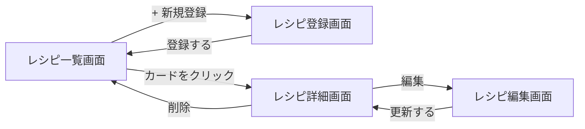

# RecipeManager 要件定義書

技術的な詳細（ER図、テーブル定義、技術スタックの選定理由、外部連携の技術方式など）は [docs/basic-design.md](./basic-design.md)（基本設計書）にまとめている。本書は「何を作るか・なぜ作るか」を中心に記載する。

## 1. 概要・背景・目的

### 概要

YouTubeやクックパッドなどのレシピサイトに掲載されているレシピを、ユーザーが自分用にまとめて管理できるアプリ。既存のレシピサイト・動画に載っている「材料・作り方」自体を作り直すのではなく、**気に入ったレシピへのリンクを、サムネイル画像・メモ・タグと一緒に保存しておくブックマーク型のアプリ**とする。

### 背景

気に入ったレシピをYouTube動画やレシピサイトで見つけても、後で見返そうとすると「どの動画だったか思い出せない」「ブラウザの履歴やブックマークだけでは整理しづらく、探し出すのに時間がかかる」といった課題がある。

また、本アプリはスクールの課題として開発するものであり、以前提出した課題（バックエンド: Java + Spring Boot、フロントエンド: React + TypeScript）とは異なる技術スタックを使用し、AWSの無料枠に収まる構成にすることが学校側の条件となっている。採用した技術とその選定理由は [基本設計書](./basic-design.md) にまとめている。

### 目的

- 気に入ったレシピを一箇所に集約し、タグやキーワードで後から簡単に探し出せるようにする
- スクール課題として、以前とは異なる技術スタック（Kotlin/Spring Boot、Next.js、MySQL、AWS）を用いた開発を経験し、実践的な技術力を身につける

## 2. 対象ユーザー

- 開発者本人のみが利用する個人用アプリ
- 複数ユーザーでの共有・ログイン機能は想定しない

## 3. 機能要件（MVP）

| # | 機能 | 内容 |
|---|------|------|
| 1 | レシピ登録 | URLを入力すると、タイトル・サムネイル画像を自動取得する。自動取得に失敗した場合は手動で入力・修正可能。あわせてメモ（自由テキスト）とタグ（自由入力、複数可）を登録できる |
| 2 | レシピ一覧表示 | 登録済みレシピをカード形式（サムネイル・タイトル・タグ）で一覧表示する |
| 3 | 検索・絞り込み | タグ名・キーワードでレシピを検索・絞り込みできる |
| 4 | レシピ詳細表示 | 登録内容（タイトル・サムネイル・メモ・タグ）を表示し、元のYouTube動画／レシピサイトへのリンクで遷移できる |
| 5 | レシピ編集 | 登録済みレシピのタイトル・サムネイル・メモ・タグを編集できる |
| 6 | レシピ削除 | 登録済みレシピを削除できる |

画面のイメージは次の「5. 画面一覧・イメージ」を参照。

## 4. 非機能要件

- **認証**: なし。ログイン機能は設けず、URLを知っていれば誰でも閲覧・編集できるオープンな構成とする（個人利用かつ小規模のため許容する判断。リスクについては「10. リスクと対応策」を参照）
- **可用性**: 常時安定稼働は必須としない（個人利用のため、ダウンタイムが多少発生しても許容する）
- **コスト**: AWSの無料枠の範囲内に収め、追加の費用が発生しない構成とする
- **対応デバイス**: 最新のブラウザを想定し、スマートフォンからも利用できるようにする

セキュリティ・保守性など実現方法の詳細は [基本設計書](./basic-design.md) を参照。

## 5. 画面一覧・イメージ

| 画面 | 役割 |
|------|------|
| レシピ一覧画面（トップ） | 登録済みレシピを一覧・検索できる画面 |
| レシピ登録画面 | 新しいレシピを登録する画面 |
| レシピ詳細画面 | 1件のレシピの詳細を確認し、元サイト・動画へ移動できる画面 |
| レシピ編集画面 | 登録済みレシピの内容を修正する画面 |

実際にクリックして画面遷移を確認できる簡易モックアップを [docs/mockup/index.html](./mockup/index.html) に用意している（ブラウザで直接開くと動作する）。

### 画面イメージ（ラフ）

**レシピ一覧画面（トップ）**
```
┌────────────────────────────────────────┐
│  RecipeManager              [+ 新規登録] │
├────────────────────────────────────────┤
│  🔍 [ キーワード / タグで検索        ]   │
├────────────────────────────────────────┤
│  ┌─────────┐ ┌─────────┐ ┌─────────┐   │
│  │ [thumb] │ │ [thumb] │ │ [thumb] │   │
│  │ 肉じゃが │ │ 唐揚げ  │ │ 味噌汁  │   │
│  │ #和食   │ │ #揚げ物 │ │ #簡単   │   │
│  └─────────┘ └─────────┘ └─────────┘   │
└────────────────────────────────────────┘
```

**レシピ登録画面**
```
┌────────────────────────────────────────┐
│  レシピを登録                           │
├────────────────────────────────────────┤
│  URL   [ https://youtube.com/...  ][取得]│
│  タイトル   [ 自動取得されたタイトル  ]  │
│  サムネイル [ プレビュー画像         ]  │
│  メモ       [                        ]  │
│  タグ       [#和食] [#簡単] [+ 追加]    │
│                                          │
│                  [キャンセル] [登録する] │
└────────────────────────────────────────┘
```

**レシピ詳細画面**
```
┌────────────────────────────────────────┐
│  ← 一覧に戻る                           │
├────────────────────────────────────────┤
│  [ サムネイル画像 ]                     │
│  肉じゃが   #和食 #煮物                  │
│                                          │
│  メモ: 醤油を控えめにすると美味しい     │
│                                          │
│  [ 元のYouTube動画・サイトを見る ↗ ]     │
│                                          │
│                       [編集]   [削除]   │
└────────────────────────────────────────┘
```

### 画面遷移



## 6. データ要件

本アプリが扱う主なデータは次の2つ。

- **レシピ**: URL、タイトル、サムネイル画像、メモを持つ
- **タグ**: レシピに付ける自由な分類ラベル

1つのレシピに複数のタグを付けられ、1つのタグは複数のレシピに使い回せる（多対多の関係）。詳細なテーブル定義・ER図は [基本設計書](./basic-design.md) を参照。

## 7. 外部連携

YouTubeの動画URLやクックパッド等レシピサイトのURLから、タイトル・サムネイル画像を自動で取得し、登録の手間を減らす。取得に失敗した場合は、ユーザーが手動でタイトル・画像を入力できるようにする。具体的な技術方式は [基本設計書](./basic-design.md) を参照。

## 8. スコープ外（今回作らないもの）

- ユーザー登録・ログイン・複数ユーザー対応
- 献立プランナー機能
- 買い物リスト自動生成機能
- レシピの材料・手順を構造化データとして保存する機能（あくまで外部レシピへのリンク管理に留める）
- YouTube動画のアプリ内埋め込み再生
- お気に入り・評価（★など）機能
- CI/CD等の自動化パイプライン（必要になった時点で別途検討）

## 9. 受け入れ基準（完成の定義）

以下をすべて満たした状態を「MVP完成」とする。

- [ ] YouTubeのURLを貼ると、タイトル・サムネイルが自動表示される
- [ ] クックパッド等レシピサイトのURLを貼ると、タイトル・サムネイルが自動表示される
- [ ] 自動取得に失敗した場合でも、手動でタイトル・サムネイルURLを入力して登録できる
- [ ] メモとタグ（複数）を付けてレシピを登録できる
- [ ] 登録したレシピが一覧画面にカード表示される
- [ ] タグ名・キーワードでレシピを検索・絞り込みできる
- [ ] レシピ詳細画面から元のURLに遷移できる
- [ ] 登録済みレシピの編集・削除ができる
- [ ] AWS上にデプロイされ、ブラウザから継続的にアクセスできる
- [ ] AWSの無料枠を超える課金が発生していない

## 10. リスクと対応策

| リスク | 影響 | 対応策 |
|--------|------|--------|
| YouTube/クックパッド側の仕様変更で自動取得が失敗する | タイトル・サムネイルが自動取得できなくなる | 手動入力フォールバックを標準機能として用意しておく（既に機能要件に含む） |
| 認証なしで公開するため、URLを知っている第三者がデータを閲覧・改ざんできる | データが意図せず書き換え・削除される可能性 | 個人利用の小規模アプリとして許容する。気になる場合は後から簡易認証を追加できるよう設計を大きく縛らない |
| AWSの無料枠を使い切り、想定外の課金が発生する | 費用が発生する | 利用料金のアラート通知を設定し、早期に気づけるようにする |
| 開発者（自分）が初めて使う技術（Kotlin, Next.js, Terraform等）が多く、学習コストで手が止まる | スケジュール遅延（提出期限はないが長期化） | 提出期限がないことを活かし、小さく動くものから段階的に積み上げる。詰まった箇所は都度相談する |

## 11. 前提・オープンな論点

- 提出期限・厳密な評価基準は現時点で設定されていない
- レスポンシブ対応の詳細度（スマホでの使用感をどこまで作り込むか）は今後の実装フェーズで調整する
